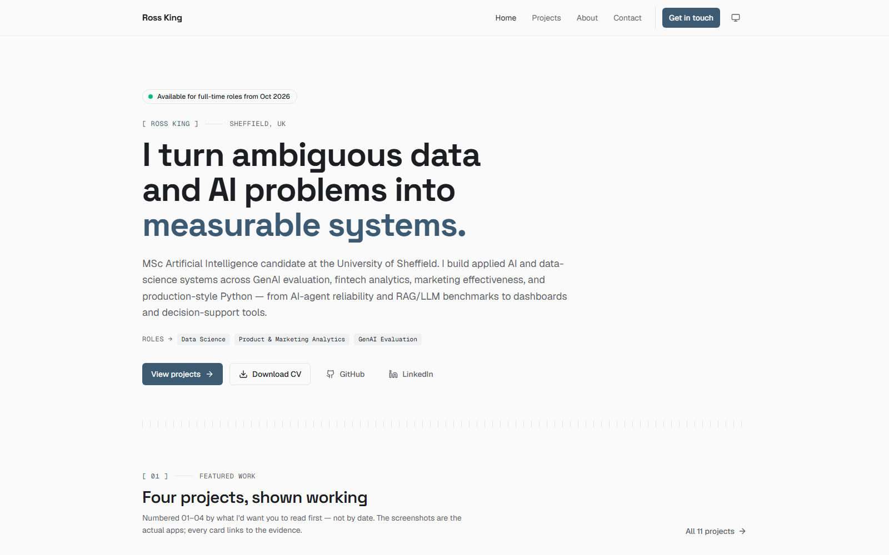

# rosscyking-portfolio

**▶ Live site:** <https://rosscyking.com>

[](https://rosscyking.com)

Personal portfolio for Cheng-Yuan (Ross) King — built with Next.js 16, React 19,
TypeScript, Tailwind CSS v4, and shadcn-style components on Radix primitives.

Static-first site with serverless functions for the contact form. Deployed on
Vercel free tier. Full test pyramid: Vitest, React Testing Library, Playwright,
axe-core. Hardened security headers and rate-limited API routes.

## Stack

- **Framework**: Next.js 16 (App Router) + React 19 + TypeScript strict
- **Styling**: Tailwind CSS v4 with CSS-variable design tokens
- **Theme**: `next-themes` (light / dark / system, persisted in localStorage)
- **Components**: shadcn-style on `@radix-ui/*` primitives, copied into `src/components/ui`
- **Animation**: `motion` (formerly Framer Motion)
- **Icons**: `lucide-react`
- **Forms**: `react-hook-form` + `zod`
- **Email**: Resend
- **Bot protection**: Cloudflare Turnstile
- **Rate limiting**: Upstash Ratelimit + Redis
- **Tests**: Vitest, Testing Library, Playwright, axe-core
- **CI**: GitHub Actions

## Getting started

```bash
# 1. Install dependencies (run this first)
npm install

# 2. Copy env template and fill values when needed
cp .env.example .env.local

# 3. Start the dev server
npm run dev
```

Open <http://localhost:3000>.

## Scripts

| Command                | What it does                         |
| ---------------------- | ------------------------------------ |
| `npm run dev`          | Start the dev server with hot reload |
| `npm run new:project`  | Scaffold a new project write-up      |
| `npm run build`        | Production build                     |
| `npm run start`        | Run the production build locally     |
| `npm run lint`         | ESLint                               |
| `npm run lint:fix`     | ESLint with autofix                  |
| `npm run format`       | Prettier write                       |
| `npm run format:check` | Prettier check (used in CI)          |
| `npm run typecheck`    | `tsc --noEmit`                       |
| `npm run check:links`  | Check project links for rot          |
| `npm run shots`        | Capture live-demo screenshots        |
| `npm run test`         | Vitest unit + component tests        |
| `npm run test:e2e`     | Playwright E2E + axe a11y tests      |

### Keeping links fresh

`npm run check:links` probes every project's `github` / `demo` / `report` /
`paper` link and reports dead links, plus GitHub repos that now **redirect**
(a sign the repo was renamed — update `links.github` to the canonical name).
A weekly **Link check** GitHub Action runs the same check and opens a tracking
issue when something breaks — it never blocks a deploy.

## Adding a project

Projects are content, not code — one MDX file per project in `content/projects/`.
Everything else (the projects list, the detail page, the sitemap, the per-project
OG image, the stack filter, and the `01–N` numbering) updates automatically.

```bash
# 1. Scaffold a draft (slug is kebab-case)
npm run new:project -- my-new-project

# 2. Edit content/projects/my-new-project.mdx, preview at /projects/my-new-project
npm run dev

# 3. When ready, delete `draft: true` from the front matter to publish.
```

Front matter is validated at build time (zod). Key fields:

| Field                       | Required | Notes                                                                 |
| --------------------------- | -------- | --------------------------------------------------------------------- |
| `title`, `summary`          | yes      | `summary` doubles as the SEO description (auto-trimmed to ~155 chars) |
| `stack`                     | yes      | array of tech tags; tags shared by ≥2 projects appear in the filter   |
| `period`, `publishedAt`     | yes      | `publishedAt` (`YYYY-MM-DD`) drives ordering                          |
| `draft`                     | no       | `true` = visible in `npm run dev`, hidden from production             |
| `featured`, `featuredOrder` | no       | feature on the home page; lower order = higher up                     |
| `metrics`                   | no       | up to 3 `{ value, label }` pairs → inline metric strip                |
| `links`                     | no       | `github` / `demo` / `report` / `paper` buttons                        |
| `screenshot`                | no       | demo screenshot for the featured showcase (`npm run shots`)           |
| `terminal`                  | no       | showcase readout lines for projects with no UI to screenshot          |

Featured-showcase screenshots live in `public/projects/screenshots/` and are
committed — re-run `npm run shots -- <slug-fragment>` when a demo's UI changes.
The "Now building" strip on the home page is data, not content: edit
`src/lib/now-building.ts`.

Updating a project is just editing its file. To remove one, delete the file.

## Folder layout

```
src/
├─ app/                 # Next.js App Router pages, API routes, layout
│  ├─ globals.css       # Tailwind v4 directives + CSS-variable design tokens
│  ├─ layout.tsx        # Root layout: ThemeProvider, Nav, Footer
│  └─ page.tsx          # Home
├─ components/
│  ├─ home/             # Hero, featured projects, skills cluster
│  ├─ about/            # Experience timeline, CV download
│  ├─ contact/          # Contact form
│  ├─ projects/         # Stack filter
│  ├─ motion/           # FadeIn entrance wrapper (reduced-motion safe)
│  ├─ layout/           # Container, Nav, Footer, ThemeProvider, ThemeToggle
│  └─ ui/               # shadcn-style primitives (Button, Badge, Input, …)
├─ lib/                 # projects loader (zod), site-config, skills,
│                       # experience, certifications, contact schema, env
content/                # MDX content (projects/, about.mdx)
public/                 # Static assets (CV, OG images, favicons)
scripts/                # new-project scaffold, link checker
.github/workflows/      # CI pipelines
```

## Design tokens

Tokens live in `src/app/globals.css` as CSS variables under `:root` (light) and
`.dark` (dark), then mapped into Tailwind's theme via `@theme inline`. Edit the
variable values to retheme the entire site without touching components.

## Deployment

Push to `main` on GitHub. Vercel deploys automatically. Pull requests get
preview URLs.

If a merge to `main` doesn't produce a new **production** deployment (Vercel
occasionally misses a push webhook after a busy run of deploys), don't rely on
the dashboard "Redeploy" button alone — it can rebuild the previous commit
rather than the new `main` HEAD. Push a fresh commit to `main` to re-trigger a
clean build from the latest commit.

## License

Private. Do not redistribute.
